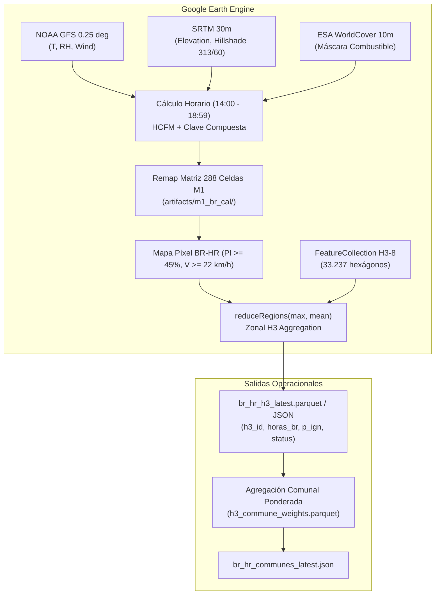

# 08 — Guía de Inferencia Operacional en Google Earth Engine (Fase 7)

Fecha de generación: 30 de agosto de 2026  
Módulos:
- [`src/gee/calibrated_module.js`](file:///d:/web_D_anctigravity/BOTON_Rojo_Chile/src/gee/calibrated_module.js): Módulo de cálculo píxel a píxel en GEE.
- [`src/gee/boton_rojo_hr_app.js`](file:///d:/web_D_anctigravity/BOTON_Rojo_Chile/src/gee/boton_rojo_hr_app.js): Aplicación interactiva para GEE Code Editor.
- [`src/gee/gee_inference_pipeline.py`](file:///d:/web_D_anctigravity/BOTON_Rojo_Chile/src/gee/gee_inference_pipeline.py): Pipeline Python automatizado para API y tareas programadas.
- [`src/gee/h3_hex_geojson_generator.py`](file:///d:/web_D_anctigravity/BOTON_Rojo_Chile/src/gee/h3_hex_geojson_generator.py): Conversor de malla H3 a GeoJSON.

---

## 1. Arquitectura de Inferencia en la Nube de Google



---

## 2. Ingesta Satelital y Colecciones Utilizadas

| Variable | Colección / Asset en GEE | Resolución Espacial | Frecuencia Temporal |
|---|---|:---:|:---:|
| **Pronóstico Meteorológico** | `NOAA/GFS0P25` | $\approx 27\ \mathrm{km}$ (0.25°) | Cada 6 horas (horario) |
| **Elevación y Pendiente** | `USGS/SRTMGL1_003` | $30\ \mathrm{m}$ | Estático |
| **Cobertura de Vegetación** | `ESA/WorldCover/v100` | $10\ \mathrm{m}$ | Anual |
| **Malla Territorial H3-8** | `data/derived/h3_chile_r8_mesh.geojson` | $\approx 74\ \mathrm{ha}$ | 33.237 hexágonos |

---

## 3. Instrucciones de Uso en el Code Editor de GEE

1. Abrir [Google Earth Engine Code Editor](https://code.earthengine.google.com/).
2. Crear un nuevo script y copiar el contenido de [`src/gee/boton_rojo_hr_app.js`](file:///d:/web_D_anctigravity/BOTON_Rojo_Chile/src/gee/boton_rojo_hr_app.js).
3. Hacer clic en **Run**.
4. La aplicación cargará el pronóstico más reciente, calculará las 5 horas de la tarde y desplegará las capas interactivas de temperatura, humedad, viento, vegetación y Botón Rojo M1.

---

## 4. Ejecución Automatizada desatendida (Python API)

Para ejecutar la inferencia diaria desde el backend o un cron job:

```bash
# Ejecución diaria estándar (genera data/derived/forecasts/)
python -m src.gee.gee_inference_pipeline
```

El pipeline genera automáticamente:
- `data/derived/forecasts/br_hr_h3_latest.parquet` (Malla completa de hexágonos)
- `data/derived/forecasts/br_hr_h3_latest.json` (Muestra para la API)
- `data/derived/forecasts/br_hr_communes_latest.json` (Resumen comunal para SENAPRED)
